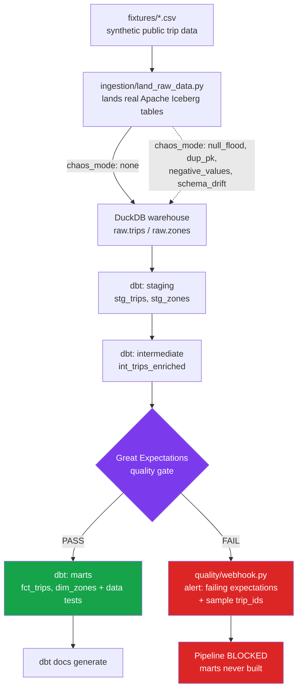

# lakehouse-quality-gate

**An active data-quality gate for a dbt + Iceberg lakehouse: it doesn't just document expectations, it blocks the pipeline and pages someone when they're violated.**


## The problem

Most "data quality" in a lakehouse is passive. Teams write dbt data_tests or Great Expectations suites, run them, and get a report -- after the bad data has already landed in the marts your dashboards and ML features read from. A null-flooded revenue column or a retried extraction job that silently duplicated half a day's records doesn't throw an exception; it just quietly corrupts everything downstream until someone notices the numbers look wrong, days later.

This project treats data quality as an enforcement point, not a report. A Great Expectations checkpoint sits physically between the dbt staging/intermediate layers and the marts. If it fails, the pipeline stops -- marts are never built on top of bad data -- and a structured alert payload, naming the exact failing expectations and a sample of the offending row IDs, goes out over a webhook. It's the difference between "our tests are red" (nobody's watching) and "the pipeline is down" (somebody gets paged).

## How it works



The same sequence -- land, stage, gate, marts, docs -- runs three ways:

1. scripts/run_pipeline.py -- a standalone CLI, run it directly, no scheduler needed.
2. dags/lakehouse_quality_gate_dag.py -- an Airflow DAG that wires the exact same task logic (dags/tasks.py) into PythonOperators.
3. tests/ -- the same functions, called directly, asserting the gate actually blocks corrupted data.

Two independent layers catch two different kinds of drift, on purpose:

- Structural drift (a column renamed/removed upstream) breaks dbt's typed cast() in the staging layer immediately -- loud, at compile/run time, before the quality gate ever executes. See the schema_drift chaos mode.
- Semantic drift (the columns are all still there, but the values are wrong -- null floods, duplicate keys, impossible negative fares) sails straight through a CREATE VIEW. This is exactly what the Great Expectations checkpoint exists to catch. See the null_flood, dup_pk, and negative_values chaos modes.

## Quick start

```bash
python -m venv .venv
source .venv/bin/activate
pip install -r requirements.txt

# Run the full pipeline against clean data -- succeeds through marts + docs.
python -m scripts.run_pipeline --chaos-mode none

# Prove the gate works: corrupt the data on the way in, watch it get blocked.
python -m scripts.run_pipeline --chaos-mode null_flood     # exit 1: GE gate blocks it
python -m scripts.run_pipeline --chaos-mode schema_drift   # exit 2: dbt itself fails first

# Run the full offline test suite.
python -m pytest -q
```

Every chaos mode is a real, documented failure a lakehouse ingestion job can actually produce -- see chaos/inject_chaos.py.

| --chaos-mode | Simulates | Caught by |
|---|---|---|
| none | (control) | -- |
| null_flood | Upstream extraction bug nulls a critical column | GE gate: expect_column_values_to_not_be_null |
| dup_pk | Retried extraction job double-writes records | GE gate: expect_column_values_to_be_unique |
| negative_values | Sign-flip bug in the source system | GE gate: expect_column_values_to_be_between |
| schema_drift | Upstream silently renames a column | dbt itself: Binder Error at staging build |

## What's in here

```
ingestion/       Lands raw data as real Apache Iceberg tables (pyiceberg + SQLite
                  catalog), then materializes the snapshot into DuckDB for dbt.
                  Swappable storage backend: local filesystem (offline/CI default)
                  or MinIO/S3 (ingestion/storage_backend.py).
chaos/           Deliberately corrupts the fixture data to prove the gate works.
dbt_project/     staging -> intermediate -> marts models, dbt data tests, dbt
                  unit tests for the safe_divide/trip_duration_minutes macros,
                  and a local DuckDB profile (dbt_project/profiles.yml).
quality/         The Great Expectations checkpoint (quality/checkpoint.py) and
                  expectation suite (quality/expectations/), plus the webhook
                  alerter (quality/webhook.py).
dags/            The Airflow DAG. Task logic (dags/tasks.py) has zero Airflow
                  import and is unit-tested without a scheduler; the DAG
                  wiring itself (dags/lakehouse_quality_gate_dag.py) is tested
                  separately, skipped automatically when Airflow isn't
                  installed (see requirements-airflow.txt).
scripts/         run_pipeline.py -- the same land -> gate -> marts sequence as
                  the DAG, runnable standalone with no scheduler.
fixtures/        Small, offline, synthetic sample with the same shape/dtypes
                  as the public NYC TLC trip records dataset.
tests/           Full offline suite: dbt model/macro behavior, the GE gate
                  blocking every chaos mode, ingestion, storage backend, and
                  DAG task logic. tests/data/test_minio_integration.py is the
                  one opt-in test that needs a real service; skipped by default.
```

## Design notes

- Why land through real Iceberg tables and not straight to DuckDB? Iceberg (via pyiceberg, a SQLite catalog over a local warehouse) gives the raw zone schema evolution and snapshot history exactly like a production lakehouse on MinIO/S3 -- verifiable fully offline, since SqlCatalog needs no cluster. DuckDB's native iceberg extension fetches over the network on first load, which would violate this project's 'no network at test time' rule, so the current snapshot is materialized straight into the DuckDB warehouse dbt reads from. A real deployment would instead point dbt-duckdb's Iceberg scanner (or Trino/Spark) directly at the Iceberg tables.
- Why two virtualenvs (requirements.txt / requirements-airflow.txt)? apache-airflow pins enough transitive dependencies tightly that installing it alongside dbt-core/great_expectations produces real, unresolvable conflicts -- a common enough problem in production that most dbt+Airflow shops run dbt in its own container/venv rather than Airflow's. This repo models that split directly: the DAG's actual logic (dags/tasks.py) never imports Airflow and is tested against the main environment; only the thin DAG-wiring file needs the Airflow environment.
- Why subprocess dbt, not the in-process dbtRunner? dbt-duckdb holds an open connection to the DuckDB file for the life of the Python process. The very next pipeline step (the GE checkpoint) needs its own independent read-only connection to that same file, and DuckDB refuses a second same-process connection under a different configuration. Running dbt as a subprocess sidesteps that entirely -- and mirrors how a real orchestrator invokes dbt as a discrete task anyway.

## Testing

```bash
python -m pytest -q          # full offline suite (DuckDB + local fixtures, no network)
ruff check .                 # lint
ruff format --check .        # formatting
```

tests/data/test_minio_integration.py and the Airflow DAG-structure tests are opt-in / environment-gated -- see their module docstrings for how to run them for real.

## Maintainer

Ragul Kumar Venkateswaran is a Data Engineer with over 4 years of experience designing and maintaining scalable data pipelines, models, and BI solutions. He specializes in Python, SQL, Airflow, and dbt to build reliable, auditable data products that power analytics and strategic decision-making.

- Email: ragulkumar2611@gmail.com
- GitHub: ragulkumar
- LinkedIn: ragulkumar

## License

MIT -- see [LICENSE](LICENSE).